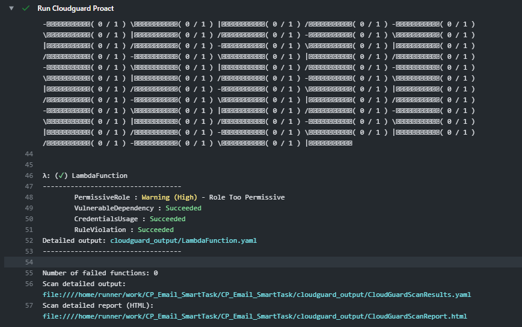
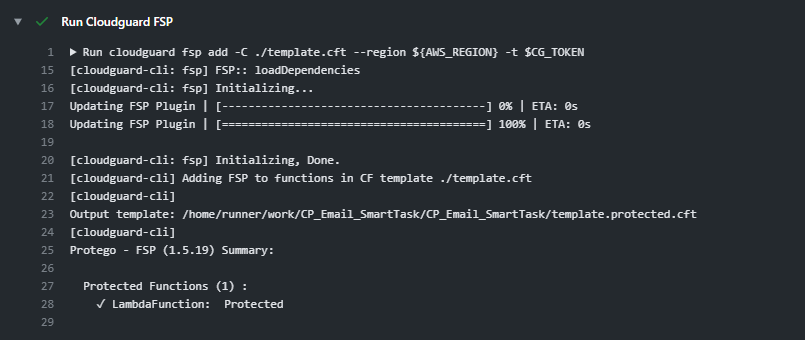

# Integrating Cloudguard Workloads with Cloudformation Templates

Written by Michael Braun

<p align="left">
    
</p>    

This document outlines the process on how to use Cloudguard Workloads with CloudFormation templates in your CI/CD pipeline. I've written a basic lambda function to use in this example. This lambda function accepts a post publish Smart Task webhook from a Check Point management server and emails the user a changes that occured since the last publish. I would not recommend using this in a production environment, as the function does not properly handle passwords.

## Prerequisites

The procedure outline below assumes that you have basic working knowdledge of AWS CLI, Cloud Formation Templates and Lamdba functions. To copy this setup, you need to have the following accounts.

[Github Account](https://github.com) <br>
[AWS Account](https://aws.amazon.com) with API keys <br>
     With the AWS CLI installed
[Check Point Cloud Security Posture Management Account](https://dome9.com/) with API keys<bt>
    
## Prepare the AWS Environment

Clone the repository and open up a terminal. In order to run the CloudFormation template, you must upload the code to an S3 Bucket.  The easiest way to do this is by using the following commands:

```
aws configure #Enter AWS API key here
aws s3 mb s3://examplebucketname
aws s3 cp ./package.zip s3://examplebucketname --acl public-read
```

The reason for this step is to allow the code to be accessed by the Lambda Function. This code creates an S3 bucket and uploads the code package.

## Preparing the Cloudguard Security and Posture Management environment.

Ensure that you have onboarded the AWS account in question. I've written a script that can quickly onboard an AWS account. That script is located [HERE](https://github.com/metalstormbass/dome9_awsonboardingv2). <br>

Once onboarded, enable the serverless functionality in Cloudguard Security and Posture Management.


## Setting up the CI/CD Pipeline with 

Please refer to  [main.yml](../.github/actions/main.yml)

First, we define the action triggers:

```
  
name: 'CI/CD'
on:
  push:
    branches:
    - master
    paths:
    - '_build_flag'
```

Next, we set up the environment and define the environment variables:
```
jobs:
  build: 
    runs-on: ubuntu-latest
    env:
      working-directory: .
      CG_TOKEN: ${{ secrets.CG_TOKEN }}
      AWS_REGION: us-east-1
      S3BUCKET: ${{ secrets.S3BUCKET }}
      TASK_PASSWORD: ${{ secrets.TASK_PASSWORD }}
      EMAIL: ${{ secrets.EMAIL }}
```
In this case we are using Github Secrets to store the credentials. <br>

The first three jobs download the dependencies:

```
 - name: "Setup Node.js"
      uses: actions/setup-node@v1
      with:
        node-version: 12.x

    - name: Checkout Code
      uses: actions/checkout@v1 
         
    - name: Configure AWS Credentials
      uses: aws-actions/configure-aws-credentials@v1
      with:
        aws-access-key-id: ${{ secrets.AWS_ACCESS_KEY_ID }}
        aws-secret-access-key: ${{ secrets.AWS_SECRET_ACCESS_KEY }}
        aws-region: us-east-1
    
    - name: Download Dependencies
      run: |
          npm install -g https://artifactory.app.protego.io/cloudguard-serverless-plugin.tgz
```

We now have our environment ready to run Proact. With CloudFormation templates, we will tell Proact all of the parameters we want to include. Further more, we will specify the location of the code. This is all done through a file called cloudguard.yml. For more information on this file and to see other examples, please see [THIS GITHUB](https://github.com/dome9/protego-examples/tree/master/proact) <br>

```
  - name: Run Cloudguard Proact
      run: |
          touch cloudguard.yml
          cat <<EOT >> ./cloudguard.yml
          Integrations:
            Cloudformation:
              Template: ./template.cft
              Parameters:
                LambdaHandler: main.lambda_handler
                Bucket: $S3BUCKET
                Email: $EMAIL
                PASSWORD: $TASK_PASSWORD
          Functions:
            LambdaFunction:
            CodeLocation: ./main
           # Only this function will override that value
            ProtegoGeneratedRole: true
          EOT
          cloudguard proact -i ./cloudguard.yml -t $CG_TOKEN 
```

If there were to be an error, you could prompt for approval. The the results of this scan are uploaded as artifacts.

```
  - name: Upload yml output
      uses: actions/upload-artifact@v2
      with:
        name: cloudguard_output.yml
        path: ./cloudguard_output/CloudGuardScanResults.yaml
   
    - name: Upload html output
      uses: actions/upload-artifact@v2
      with:
       name: cloudguard_output.html
       path: ./cloudguard_output/CloudGuardScanReport.html   
```

Once the Proact scan is finished, we then move on to adding the FSP runtime protection. This will take the CloudFormation Template (template.cft) and add the FSP layer to the Lambda function. The resulting file will have a .protected added to it. This is also uploaded as an artifact

```
  - name: Run Cloudguard FSP
      run: |
          cloudguard fsp add -C ./template.cft --region ${AWS_REGION} -t $CG_TOKEN
            
    - name: Upload Protected CFT
      uses: actions/upload-artifact@v2
      with:
       name: template.protected.cft
       path: ./template.protected.cft
```

Finally, we then take this protected file and deploy it to AWS.

```
  - name: Deploy to AWS
      run: |
           curl "https://awscli.amazonaws.com/awscli-exe-linux-x86_64.zip" -o "awscliv2.zip"
           unzip awscliv2.zip
           sudo ./aws/install 
           aws cloudformation deploy --template-file ./template.protected.cft --stack-name CPTask --parameter-overrides Bucket=$S3BUCKET PASSWORD=$TASK_PASSWORD Email=$EMAIL --capabilities CAPABILITY_IAM
```

NOTE: You may need to adjust the last line if you want to include different paramters. <br>

## Results

IF you examine the "Action" Tab, you will see the following results. 

Proact:



FSP:



Then in AWS, you will see the added layer to the Lambda Function:


And finally in Clouguard Security and Posture Management:


